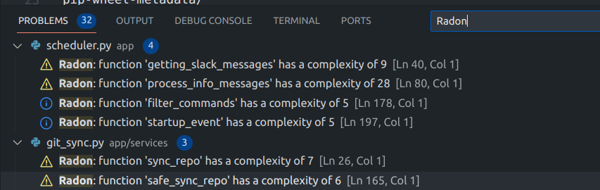
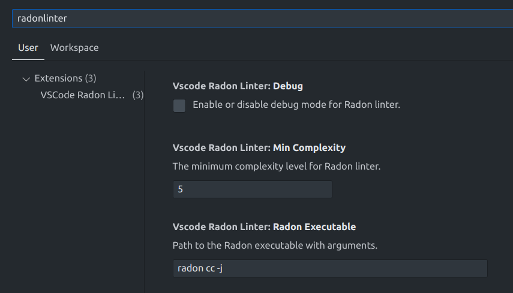

# vscode-radon-linter

## Description

This is a Visual Studio Code extension for linting Python code using the Radon library. Once installed, the extension automatically checks Python files for potential issues and displays them in the Problems tab. This helps developers identify and fix issues such as code complexity, maintainability, and other potential problems that could lead to bugs or make the code harder to read and maintain.

The extension is capable of processing individual files, all Python files in the workspace, and all workspace folders, making it easy to analyze multiple Python files at once. This is particularly useful in larger projects where manually checking each file would be time-consuming.

The extension uses Radon to analyze Python code and produces output that includes the cyclomatic complexity of blocks of code, the type of the block (e.g., "function", "method", "class"), the name of the block, and the line number where the block starts. This detailed output helps developers understand the structure and complexity of their code at a glance.

The extension uses a configuration setting to determine the Radon executable to use, and it has a debug mode that can be enabled to log the Radon runs. This makes the extension highly customizable and adaptable to different development environments and workflows.

The extension is easy to use and integrates seamlessly with Visual Studio Code, making it a valuable tool for Python developers who want to ensure their code is clean, efficient, and follows best practices.

## Table of Contents

- [Features](#features)
- [Requirements](#requirements)
- [About Radon](#about-radon)
- [Installing Radon](#installing-radon)
- [Getting Started](#getting-started)
- [Usage](#usage)
- [Extension Settings](#extension-settings)
- [Commands](#commands)
- [Known Issues](#known-issues)
- [Release Notes](#release-notes)
- [Building and Testing](#building-and-testing)
- [Contributing](#contributing)
- [Author](#author)
- [License](#license)

## Features

- Automatic linting of Python files using Radon
- Display of potential issues in the Problems tab
- Identification of code complexity, maintainability, and other potential problems
- Ability to process individual files, all Python files in the workspace, and all workspace folders for linting multiple Python files at once
- Detailed output that includes the cyclomatic complexity of blocks of code, the type of the block (e.g., "function", "method", "class"), the name of the block, and the line number where the block starts
- Configuration setting to determine the Radon executable to use
- Debug mode that can be enabled to log the Radon runs
- Seamless integration with Visual Studio Code

## Example

Once the extension is installed and active, it will automatically lint your Python code using Radon and display potential issues in the Problems tab of Visual Studio Code. Here is an example of what you might see:



In this example, the Problems tab shows the issues detected by the vscode-radon-linter extension. Each issue includes the type of the block (e.g., "function", "method", "class"), the name of the block, the cyclomatic complexity of the block, and the line number where the block starts. You can click on an issue to navigate directly to the corresponding line in your code.

## Requirements

- Visual Studio Code version 1.85.0 or higher
- Python
- Radon

## Installation

Follow these steps to install the extension in Visual Studio Code:

1. Open Visual Studio Code.
2. Click on the Extensions view icon on the Sidebar (or press `Ctrl+Shift+X` to open it).
3. In the Extensions view, enter the name of the extension (vscode-radon-linter) in the search box and press `Enter`.
4. From the list of extensions, find the one you want to install and click on the Install button.

Here is an image to help you understand the process:


After the installation is complete, you may need to reload Visual Studio Code for the changes to take effect.

## About Radon

Radon is a Python library that computes various metrics from the source code. Radon can compute:

- McCabe's complexity, i.e., cyclomatic complexity
- raw metrics (these include SLOC, comment lines, blank lines, &c.)
- Halstead metrics (all of them)
- Maintainability Index (the one used in Visual Studio)

For more information about Radon, including how to use it and how it calculates cyclomatic complexity, refer to the [Radon documentation](https://radon.readthedocs.io/). The source code for Radon is available on [GitHub](https://github.com/rubik/radon).

## Installing Radon

Radon is a Python library and can be installed using pip, the Python package installer. If you have Python and pip installed, you can install Radon by running the following command in your terminal:

```bash
pip install radon
```

If you're using a specific Python environment or if you want to install Radon as a project dependency, you might need to use a different command. Refer to the pip documentation and your environment's documentation for more information.

## Usage

1. Install the extension from the Visual Studio Code marketplace.
2. Open a Python file or workspace.
3. The extension will automatically lint your Python code using Radon and display potential issues in the Problems tab.

## Extension Settings

This extension contributes the following settings:

- `vscodeRadonLinter.minComplexity`: The minimum complexity level for Radon linter. Default is 5.
- `vscodeRadonLinter.debug`: Enable or disable debug mode for Radon linter. Default is false.
- `vscodeRadonLinter.radonExecutable`: Path to the Radon executable with arguments. Default is "radon cc -j".

To access these settings, follow these steps:

1. Open Visual Studio Code.
2. Click on the gear icon in the lower left corner to open the main menu.
3. Click on "Settings".
4. In the search box at the top of the Settings tab, enter "vscodeRadonLinter" to filter the settings.

Here is an image to help you understand the process:



## Commands

This extension contributes the following command:

- `extension.vscodeRadonLinter.lint`: Run vscodeRadonLinter

## Known Issues

Please report any issues on the GitHub repository.

## Release Notes

### 1.0.0

Initial release of vscode-radon-linter

## Building and Testing

This project uses webpack for building and vscode-test for testing. The following npm scripts are available:

- `npm run compile`: Compile the project using webpack
- `npm run watch`: Compile the project and watch for changes
- `npm run package`: Package the project for production
- `npm run compile-tests`: Compile the tests
- `npm run watch-tests`: Compile the tests and watch for changes
- `npm run pretest`: Run pretest tasks
- `npm run lint`: Lint the source code
- `npm run test`: Run tests

## Author

Vadim Nareyko

For any questions or concerns, please contact vadim@nareyko.com

## License

This project is licensed under the MIT License. See the LICENSE.txt file in the project root for more information.
